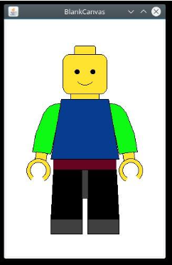
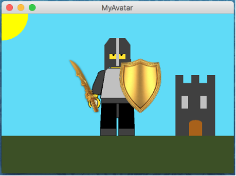

**NOTE: Before beginning the lab, please remember to [open the workspace](images/open-lab-workspace.png) after cloning this repository in VSCode.**

# Module 3 Week 1 Activity - MiniFig (two class periods)

## Purpose & Concepts 
The purpose of this activity is to practice using the following concepts: Class, Object, Attribute, Method, API, Constructor, Instantiate, Invoke, Dot operator, Reference variable, Alias, Graphics, Pixels, Coordinate system, RGB, Anchor point/Offset

Specifically, you will practice declaring and instantiating objects, using constructors, invoking methods on objects, using getters and setters (types of methods), and using aliases - all while using good coding conventions.

## Problem Description
In this activity you will write a program that uses the provided [MiniFig](https://boisestate.github.io/CS121-Public/MiniFig/) class to create your own Avatar. 

You will use two files:
- `MiniFig.java` - that defines the MiniFig class. You will not modify this file.
- `MyAvatar.java`  - that will use objects of type MiniFig. This is where you will do your programming.

## Requirements
1. MyAvatar.java has 8 TODO items.  Your first task is to work through each of these. 
After completing these TODO items, you will use methods from the [Graphics](https://docs.oracle.com/javase/8/docs/api/java/awt/Graphics.html) class to perform three additional tasks. 
2. Add some background scenery.
3. Give your MiniFig an accessory to hold in its hand using either getLeftHandCenterPoint() or getRightHandCenterPoint() to place the accessory. 
4. Give your MiniFig a hat or some hair. Use getCapPoint(), getFaceWidth(), and getFaceHeight() methods to help place your headpiece. You may reference [Bob's Hat, a Tutorial](https://docs.google.com/document/d/1kEYfxX3jC8NiJgEegYtm8GWzaQ-ljTqCUG-EOYl0p2M/edit?usp=sharing˜)
5. Sizes and positions of all scenery, accessories, and headpieces should adjust appropriately when the window is resized.

Here is an example of an avatar with background scenery, something in its hand, and a headpiece to show you what sorts of things are possible.

## Before You Begin: Computational Thinking & Planning
1. Read MiniFig.java and MyAvatar.java.  Make note of each TODO given in MyAvatar.java
2. Add sub-comments as needed to outline what you need to do. Make note of what information and methods are available to you.

## To Do
1. Expand the folder named a3.1-MiniFig and open the file named MyAvatar.java
2. Using the steps you outlined before, modify MyAvatar.java to accomplish each of the TODO items.
3. Now that you have worked through the first portion of the activity, can you add more details to your plan for the scenery, accessory, and headpiece? Add comments where you intend to add more details and state what you're adding.
4. Modify MyAvatar.java to add scenery, accessory, and headpiece.

## Review & Reflect
1. Terminology Identification: Identify examples of at least 4 different concepts listed in the "Concepts" list above. These should be identified with an @keyterm tag within the comment.
2. Code Review: When you are finished with this activity, pair up with a classmate and review each other’s code to make sure it meets all the requirements. 
3. Reflection: At the end of REFLECTION.md write a one paragraph reflection describing your experience with this activity. What went well? What was challenging? How could you improve your plan prior to beginning to code? 

## Finally
1. Commit the changes to your local repository with a message stating that Activity 3.1 is complete.  You can do this using the Terminal or the GUI.
2. Push the changes from your local repository to the GitHub classroom repository.  Again, you can do this using the Terminal or the GUI.
