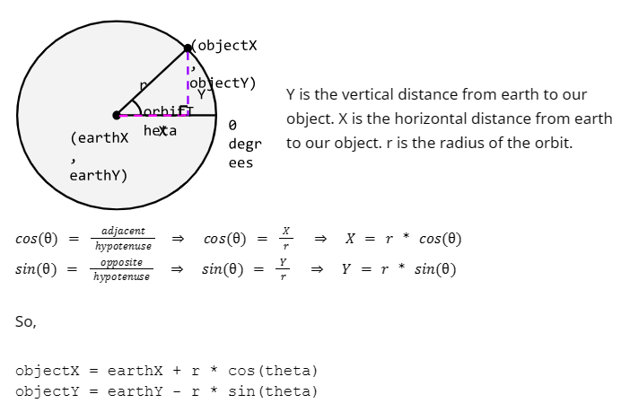

**NOTE: Before beginning the lab, please remember to [open the workspace](images/open-lab-workspace.png) after cloning this repository in VSCode.**
# Module 3 Week 2 Activity - Geocentric Orbit

## Purpose & Concepts
The purpose of this activity is to practice using prior concepts and the following new concepts: Pseudo-random numbers, random number generator, Seed values, Static methods.  

## Problem Description
In this activity you will write a program that uses the Random and Math classes to animate an object orbiting the Earth. You will use **Orbit.java** and [earth.png](images/earth.png). 

## Requirements
You will modify Orbit.java to accomplish the following:
1. Define an orbitRadius variable.  Assign it the minimum of 1/3 the width and 1/3 the height of the screen (Use Math.min and the provided width and height variables)
2. Use this radius to draw the orbit around the Earth. Important: the given earthX and earthY variables define the middle of the Earth, not the top-left corner.  We are doing this to simplify our orbit position calculations.
3. Define an objectRadius variable and assign it 1/3 the earthRadius. This will be used to draw a circle orbiting around the Earth.
4. Use trigonometric functions to calculate your object's x and y coordinates. 
5. Draw your object (use the fillOval method) using the objectRadius, objectX, and objectY values you have calculated.
6. Create a random color and use that to draw your object.
7. In the Orbit() constructor, use Random to get a random orbitDelta (direction and magnitude of the orbit angle change in each step).
8. If you have time, replace your oval object with an image of your choice.

## Before You Begin: Computational Thinking & Planning
1. Read Orbit.java.  Notice what variables are defined for you.
2. Add algorithm comments as needed. Be sure to make note of what information you need at each step and how you can use what you know to find it.

## To Do
1. Expand the folder named a3.2-GeocentricOrbit and open the file named Orbit.java.
2. Modify Orbit.java to satisfy the requirements given above.

## Review & Reflect
1. Terminology Identification: Identify examples of at least 4 different concepts in the following list: pseudo-random numbers, static methods, seed value, random number generator, declaration, instantiation, invocation, dot operator. These should be identified with an @keyterm tag within the comment.
2. Code Review: When you are finished with this activity, pair up with a classmate and review each other’s code to make sure it meets all the requirements. 
3. Reflection: At the end of REFLECTION.md write a one paragraph reflection describing your experience with this activity. What went well? What was challenging? How could you improve your plan prior to beginning to code? 

## Finally
1. Commit the changes to your local repository with a message stating that Activity 3.2 is complete.
2. Push the changes from your local repository to the GitHub classroom repository.
