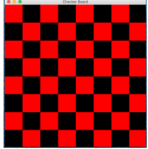
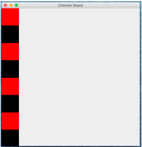

**NOTE: Before beginning the lab, please remember to [open the workspace](images/open-lab-workspace.png) after cloning this repository in VSCode.**
# Module 4 Week 2 Activity - GameBoard (two class periods)

## Purpose & Concepts: 
The purpose of this activity is to practice getting user input, using nested for loops, using nested while loops, and using the modulo operator.

## Problem Description
In Phase 1 of this activity, you will prompt the user for dimensions for a "game board" and then output a text game board with those dimensions to the console using a checkerboard pattern of "x"s and "o"s. For example, if the user gave dimensions for an 8x8 board (a standard size for a checkerboard) the console output would look like this:
```
xoxoxoxo
oxoxoxox
xoxoxoxo
oxoxoxox
xoxoxoxo
oxoxoxox
xoxoxoxo
oxoxoxox
```

In Phase 2 of the activity, you will use logic similar to that you developed for the text game board to draw a GUI game board using nested for loops. For example, if the user gave dimensions of 8x8 the board would look like this:



## Requirements
1. Phase 1: In a driver class called GameBoardConsole.java do the following
    - Get the game board dimensions from the user
    - Use a while loop to print the first row of the game board with alternating "x"s and "o"s to the console.
    - Use nested while loops to print the rest of the board
    - **HINT: the character should be an "x" if the row and column number are both even or both odd. The character should be "o" if one is even and one is odd.**
2. Phase 2: In a driver class called GameBoardGUI.java do the following
    - Draw a single column of the red and black game board using a for loop 
    - Use a nested for loop to extend to a full game board. Make sure to use the `numCols` variable in your inner for-loop condition. **HINT: Squares should be red if the row number and column number are both even or both odd. Squares should be black if one is even and one is odd**

## Before You Begin: Computational Thinking & Planning
1. Look through GameBoardConsole.java and make comments for the steps you need to take.
2. After completing Phase 1, add comments to create a plan for Phase 2.
   
## To Do
1. Expand the folder named a4.2-GameBoard and open the file named GameBoardConsole.java
2. Modify GameBoardConsole.java to get the game board dimensions from the user and print a single row of the game board.
3. Create a plan (using line comments) for Phase 2. 
4. Using the steps you create, modify GameBoardGUI.java to draw the first column of the game board. 
5. *After* successfully drawing the first column, draw the rest of the game board.


## Review & Reflect
1. Terminology Identification: Identify examples of at least 4 different concepts listed in the "Concepts" list above. These should be identified with an @keyterm tag within the comment.
2. Code Review: When you are finished with this activity, pair up with a classmate and review each other’s code to make sure it meets all the requirements. 
3. Reflection: At the end of REFLECTION.md write a one paragraph reflection describing your experience with this activity. What went well? What was challenging? How could you improve your plan prior to beginning to code? 

## Finally
1. Commit the changes to your local repository with a message stating that Activity 4.2 is complete.
2. Push the changes from your local repository to the GitHub classroom repository.