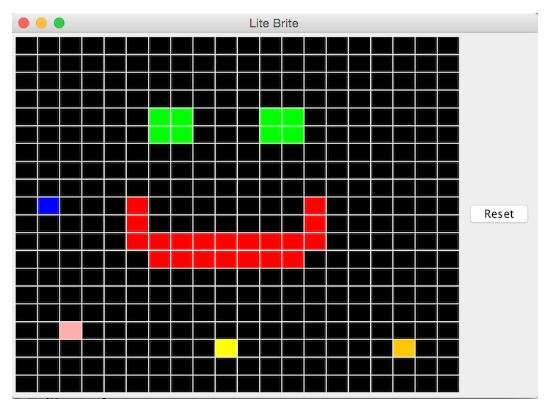

**NOTE: Before beginning the lab, please remember to [open the workspace](images/open-lab-workspace.png) after cloning this repository in VSCode.**
# Module 8 Week 1 Activity - LiteBrite

## Purpose & Concepts: 
The purpose of this activity is to practice the following concepts: GUI, Even Driven Programming, Components, Event, Listener, JFrame, JPanel, ActionListener Interface, Event Source, Extending Components, Layouts, Layout Managers, Sub-panels. In this activity you will:
    - Manage the GUI layout using sub-panels.
    - Write classes that effectively manage program data and delegate responsibility for program logic.
    - Use a GridLayout for displaying a 2D array of objects.
    - Implement and add ActionListeners to GUI components to handle click events.

## Problem Description
In this activity, you will create a GUI modeled after [Lite-Brite](https://www.youtube.com/watch?v=gGCu0ezL4-U). This activity also helps to reinforce 2D array functionality. 


## Before You Begin: Computational Thinking & Planning
1. Before beginning, read all provided code.
2. Add the steps you need to take using line comments for Phase 1
3. After completing Phase 1, add a plan using line comments for Phase 2.
   
## To Do
1. Expand folder a8.1-LiteBrite and create LitePegButton.java
2. Execute the plan you created to satisfy all requirements for the LitePegButton class
3. *After* LitePegButton has been thoroughly tested and is working correctly, create a plan for Phase 2.
4. Execute the plan you created to satisfy all requirements for the LiteBriteBoardPanel class


## Requirements
Phase 1: LitePegButton class
1. Create class LitePegButton that extends JButton. It will represent the state of a single colored peg.
    - LitePegButton should have a constant COLORS array with several colors. Use an initializer list to create this array. The first color must be Color.BLACK. Choose three or four additional Colors for the rest of the values. Recommend red, green, blue, and yellow.
    - LitePegButton should have a single instance variable: int colorIndex. 
    - In the constructor, initialize this index to 0 and set the button’s initial background color to black.
    - Write a public void reset() method that sets the color index to 0 and the button's color back to black.
    - Write a public void nextColor() method that advances the colorIndex and sets the button's color to the corresponding color from COLORS. The index should loop back to 0 when you've run out of valid indexes.
2. Add one LitePegButton to the LiteBritePanel to test that a single button works correctly. Clicking this button should cycle through the colors defined in its COLORS array.
    - Use the button's addActionListener() method to register an instance of the LitePegListener (see the next item) to receive click events for this button.
    - Write private inner class LitePegListener implements ActionListener. (See given ResetButtonListener as a reference.) Its actionPerformed() method should call the nextColor() method of the LitePegButton that was the source of the ActionEvent.

**NOTE:**  If you are working on a MacOS system, you’ll need to set the following options inside the constructor of the LitePegButton for the backgrounds to be displayed properly.
```
this.setOpaque(true); 
this.setBorderPainted(false);
```

Phase 2: LiteBritePanel class
1. Update LiteBritePanel to implement the features as described here:
    - LiteBritePanel should have only one instance variable: a 2D array of LitePegButtons.
    - The LiteBritePanel constructor should build a subpanel to hold a grid of LitePegButtons. Set the layout manager of this panel to a GridLayout with the number of rows and columns specified in a BOARD_DIMENSION constant. Also initialize the 2D array of LitePegButtons with these same dimensions. Populate the array and the layout with LitePegButtons.
      - **Note:** The array of buttons is needed because while the GridLayout organizes components into a grid, you cannot access those components by coordinates after they are placed. You need the array to be able to access your button references by their location later in the program.
      - To get the buttons to be square, you need to set the preferred size for each LitePegButton to square dimensions (e.g. 30x30). 
      - All LitePegButtons should share a single instance of LitePegListener.
    - Update the ResetButtonListener to call the reset() method of every LitePegButton in the array in actionPerformed().
    - Confirm that the grid of LitePegButtons is correctly displayed, that every peg independently cycles through its colors when clicked, and that clicking the Reset button causes all pegs to reset to black, after which they still cycle correctly through colors.




## Review & Reflect
1. Terminology Identification: Identify examples of at least 4 different concepts listed in the "Concepts" list above. These should be identified with an @keyterm tag within the comment.
2. Code Review: When you are finished with this activity, pair up with a classmate and review each other’s code to make sure it meets all the requirements. 
3. Reflection: At the end of REFLECTION.md write a one paragraph reflection describing your experience with this activity. What went well? What was challenging? How could you improve your plan prior to beginning to code? 

## Finally
1. Commit the changes to your local repository with a message stating that Activity 8.1 is complete.
2. Push the changes from your local repository to the GitHub classroom repository.