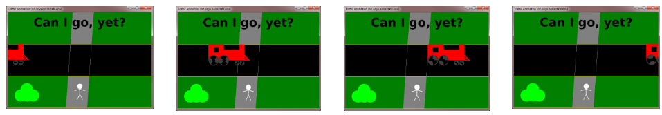

**NOTE: Before beginning the project, please remember to [open the workspace](images/open-lab-workspace.png) after cloning this repository in VSCode.**
# Project 0: Traffic Animation

## Purpose & Concepts: 
In this project you will demonstrate your understanding of concepts covered in modules 1-3. In particular, you will use your understanding of classes and methods, variables and expressions, the Graphics and Color classes, the coordinate system, scaling, and anchor points.

## Problem Description
In this project you will create an animation of a vehicle moving across the window in a lane. Your scene will inlude an avatar watching the vehicle move by and some interesting scenery. You have the flexibility to draw whatever you would like as long as it meets all the requirements given below.

## Requirements
1. Draw your vehicle relative to an anchor position (the xOffset variable) so that the position of your vehicle will change every time the paintComponent() method is called.
2. Your vehicle must have a minimum of a cab, body, and two wheels. If you choose to make your “vehicle” something other than a car, it must still be composed of *at least* 4 different components. The sample square cannot be used as part of your vehicle.  (**Note** This means at least four calls to graphics methods to create your vehicle. For example, this could mean two rectangles and two circles or it could mean a filled rectangle, an unfilled rectangle, a triangle, and an oval. For this count they may be the same shape.) 
3. Your vehicle must scale proportionately when resized.
4. When the vehicle goes off one edge of the window, it should come back on the other edge. The TrafficAnimation() constructor method in the provided starter code sets up the animation and updates the xOffset anchor coordinate for you. Make sure that you draw your vehicle relative to this coordinate.
5. Draw a visual lane along which the vehicle moves and background elements to create a scene. (See the [examples](images/trafficAnimationExamples.png)) Make sure the lane and scenery scale correctly by specifying the position and dimensions relative to the width and height of the screen.
6. Draw an **avatar observer** to the scene, out of the path of traffic. Your avatar must be composed of a minimum of a circle, with eyes, nose, and mouth (or at least 4 other shapes). It must also scale proportionately when resized.
7. Use at least **five different methods** from the Graphics class to draw the vehicle and environment. This means different shapes (rectangles, ovals, lines) as well as both fill and draw methods. (Multiple calls to the same method counts as using one method. Use at least 5 *different* methods.)
8. Display some **text** in the window - a title, a quotation or whatever seems appropriate for your scene.
9. Use at least **three colors** in your scene. At least one of them should be a **custom color**. There are a number of sites on the web where you can find [color samples](http://en.wikipedia.org/wiki/Web_colors#X11_color_names) with their RGB values.
10. Make your scene adjust appropriately when the window gets resized. For example, centered text should remain centered, the vehicle should travel the entire width of the window, and all graphics should adjust or scale as needed. [This image](images/DrawingScaling.jpg) provides some hints on how scaling and positioning can be accomplished.
11. Provide a good description of the program at the beginning of the javadoc comment. Your class comment must include an `@author` tag with your name at the end of the comment. This will list you as an author of the program when documentation is generated from the javadoc comments.
12. Be sure to use good coding conventions as outline [here](https://docs.google.com/document/d/1LWbGQBKkApnNAzzgwOSvRM03DmhYWx5yEfecT2WXfjI/edit). In particular, pay attention to consistent indentation and vertical spacing, camelCase for methods and variables, TitleCase for any class names, CAPITAL_LETTERS for constants, and good inline comments to describe what each piece of code you write is doing.

**NOTE:**  You may add whatever else you want to the scene to make the picture interesting! `:)`

## Before You Begin: Computational Thinking & Planning
1. Before you begin, sketch out on paper a picture of what you want to create. Label each component with shape, relative coordinates, anchor points, etc. Each variable that represents a value on your image should be shown on your picture. Include this sketch in your PLAN.md (e.g. take a picture of it and store it in the `images` diretory. See the markdown for this README file for the syntax to include a picture in your PLAN.md.) You may include multiple images if your plan changes as you work on the project.
2. Open `TrafficAnimation.java` and read it thoroughly to understand what variables are defined for you and what variables you need to create. 
3. Fill in PLAN.md. Make note of each component that needs to be included in the scene. Each component should be a high level task. Feel free to break large components into intermediate goals if that would be helpful for you.
4. Notice there are some differences in the PLAN.md requirements from the activites. Be sure to read through all of PLAN.md. Pay special note to the requirement to **cite sources** used outside of class material.
5. This project has a lot of requirements. Take a moment to be sure you are meeting all of them!

## To Do
1. Open `TrafficAnimation.java` in the `Project0` folder.  
2. Execute the plan you created in PLAN.md.
3. Be sure to review the requirements given in this document as well as the rubric in PLAN.md.
    

## Review & Reflect
1. Write a two to three paragraph reflection describing your experience with this project. Talk about what worked well and what didn't work so well in planning, coding, and testing.  Did you run into an issue that took some time to figure out?  Tell us about it. Write the reflection in PLAN.md

## Finally
1. Commit the changes to your local repository with a message stating that Project 0 is complete.
2. Push the changes from your local repository to the github classroom repository.