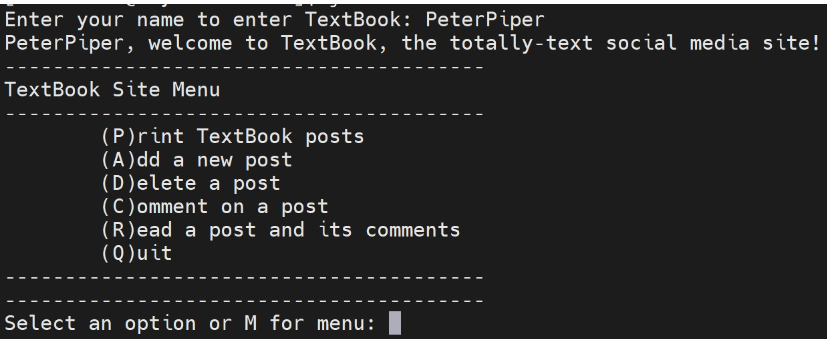
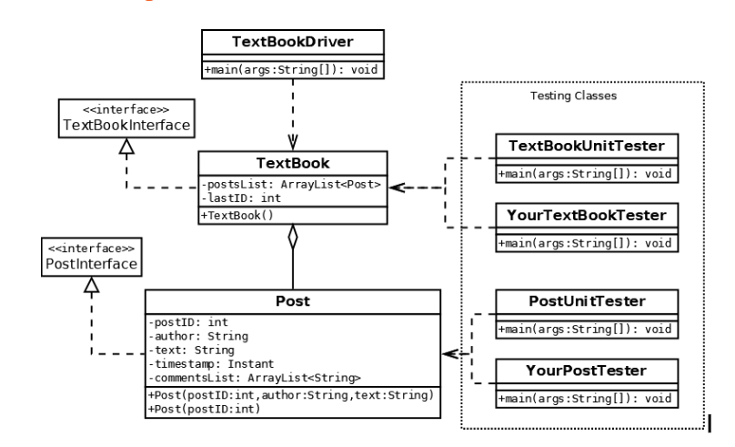
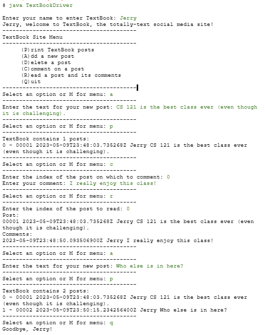
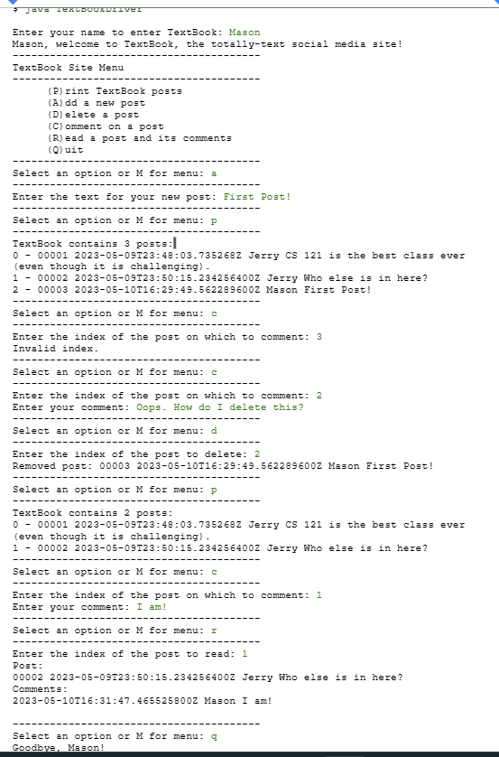

**NOTE: Before beginning the project, please remember to [open the workspace](images/open-lab-workspace.png) after cloning this repository in VSCode.**
# Project 2: TextBook

## Purpose & Concepts: 
In this project you will demonstrate your understanding of concepts covered through module 6.  In particular, in this project you will 
develop a program that consists of multiple custom classes that enforce encapsulation, utilize instance variables including collections, and implement multiple methods as defined in interfaces.  You will also use interfaces to develop and test classes with a predefined API, and you will read and write files.

## Problem Description
TextBook is a super-retro, text-only, one-user-at-a-time, console-based social media platform. This application allows the current user to add posts, remove posts, comment on posts, display the list of all posts, and select a post to read with all its associated comments. Posts and comments are recorded in files, so the state of the TextBook can be recovered (reloaded from files) the next time the program is run.

When the user runs the program, they will first be asked for their username.  Then they will be greeted and presented with a menu.  From here users will be able to add new posts, comment on existing posts, delete posts, etc. Below is an example of what the beginning of the program should look like for the user.



You will write three classes: Post.java, TextBook.java, and TextBookDriver.java. Pay close attention to the details given for each class in the project specifications below and in interface files.  As you are developing your code keep in mind how to break the overall project into smaller pieces. 

Refer to the UML class diagram below for a view of how the classes and interfaces are related.



## Requirements

### Post.java
This class represents a single post and its associated comments. When a new Post is first created in the program, an associated post file is written to record the original post information. Whenever a comment is added to the Post, the comment data is appended to this file. This file will be used to recover all data for this Post and its comments when the program is restarted. The purpose of the post ID is primarily to uniquely identify the associated file for a Post.

- Post must implement the provided PostInterface: `public class Post implements PostInterface`
- Attributes: `author`, `text`, `timestamp`, `postID`, `commentsList`. 
- Both `text` and `author` are Strings; `timestamp` is a [java.time.Instant](https://docs.oracle.com/javase/8/docs/api/java/time/Instant.html); `postID` is an int; and `commentsList` is an ArrayList<String>. Enforce encapsulation by setting the visibility of all instance variables to private. Note that author is expected to be a one-word username, i.e. “AdaLovelace”, not “Ada Lovelace”. This will simplify file parsing later on.

Constructors: There are two required `Post` constructors, one to create a brand new Post and the other to restore a Post from an existing post file. 
  
- New Post constructor: 
  - Three parameters are required to create a new Post: `postId`, `author`, and `text`.  
  - The `timestamp` should be set to the moment the constructor was called (obtained from `Instant.now()`). 
  - A file named with format `“Post-<postId>.txt”` should be created in this constructor and the first line should be written with the `postID`, `timestamp` in ISO-8601 format (as returned by `Instant’s toString()`), `author`, and `text`. Separate values with simple whitespace (space or tab) for ease of reading values from the file later.
  - The ID in the filename should be formatted to be 5 digits long using the `DecimalFormat` class. For example, if the ID is 12, the post file should be named `“Post-00012.txt”`. (This is the exact filename expected from Post’s `getFilename()` method.)
  - First line format: `<postId> <timestamp> <author> <text>`
  - Example first line:
```
00012 2010-08-30T13:38:23.085Z Sam Pondering the meaning of static.
```

- Post recovery constructor: 
  - The only parameter will be a `postID`. 
  - This constructor should open the `Post-<postID>.txt` file corresponding to the given `postID` (formatted to 5 digits) and set all instance variables to the values as read from the first line of the file. 
  - **Note** that `Instant` has a `parse()` method that returns an `Instant` object reference after parsing a String in ISO-8601 date/time format.
  - After reading whitespace separated tokens for ID, timestamp, and username, the entire remainder of the first line is the post text.
  - Each additional line in the file is a comment. Each comment line can be read as a single String and stored directly in the commentsList.
  - Example file for a Post with 2 comments:
```
00012 2010-08-30T13:38:23.085Z Sam Pondering the meaning of static.
2010-08-30T14:21:23.115Z Pat Like noise? Or electricity?
2010-08-31T09:25:19.081Z Sam No. It’s an OOP concept.
```

  - Since this constructor will need to open the file in a Scanner, it needs to catch `FileNotFoundException`. When the exception is caught, print a message stating that the file was not able to be opened.
  - See `PostInterface` for descriptions and expectations for all required methods.

**NOTE:** The recovery constructor is the only place `Post-<postID>.txt` files should ever be read in the whole program.

**Note:** Formatting an int to a specific number of digits, as needed for forming `Post-<postID>.txt` filenames and in `toString()` and `toStringPostOnly()` output, should be accomplished using the `DecimalFormat` class.
  
**Note:** `Post-<postID>.txt` file should only be opened for writing/appending in the new Post constructor and `addComment()` method.

### TextBook.java
This class manages a collection of Posts and provides methods for interacting with its collection. When a `TextBook` is created, it attempts to recover Posts for all IDs listed in a file named in constant `TextBookInterface.POST_LIST_FILENAME`. TextBook updates this file whenever Posts are added or deleted from the TextBook.

- Attributes: `postsList`, `lastID`. `postsList` is an ArrayList<Post> and `lastID` is the last/largest known post ID or 0 if no Posts exist. Be certain to set visibility of all instance variables to private in order to enforce encapsulation.
- Constructor: No parameters are expected. Initialize `postsList` as an empty `ArrayList` of `Post` objects and set `lastID` to 0.	
Attempt to open the post IDs file (filename stored in constant `TextBookInterface.POST_LIST_FILENAME`) and populate the list with Posts corresponding to each ID read from the file. Store the last read ID in `lastID`. If no post IDs file exists, there is simply nothing to recover from a previous session. Do not report this situation as a problem with the program. You are simply initializing a new empty `TextBook`.
- The `post IDs` file contains only the `post IDs` that are currently included in the `TextBook`. Every time a new `post` is created, its ID is appended to the `post IDs` file. When a `post` is deleted, the `posts` file must be rewritten so only current `IDs` are included. This file identifies all `Posts` to recover next time the program is run.
- Example: Assuming 5 `Posts` have been added to a new TextBook and the `Post` with `ID 3` (was at index 2) has been deleted, the posts file would contain:
```
1
2
4
5
```
- See TextBookInterface for descriptions and expectations for all required methods.

**Note:** `getPosts()` is intended for testing only and should not be used anywhere in `TextBookDriver`.

### TextBookDriver.java
This is the driver for the project, containing the main() method which is the entry point for the application. This class creates a `TextBook` instance and provides console menu logic allowing the user to interact with the `TextBook`. This class should have **no** instance or class variables. Do **not** create an ArrayList<Post> locally or duplicate any functionality in the driver class that belongs to the `TextBook` or `Post` classes.

- Welcome the user to your TextBook social media platform and ask them for their one-word login name, which will be used as the author for all subsequent posts and comments.
- Use a while loop, switch statement, and keyboard Scanner to build a basic console menu system. The menu UI should display a list of options and allow the user to “(p)rint the textbook (indexed list of posts), (a)dd a post to the TextBook, (d)elete a post from the TextBook, (c)omment on a post, (r)ead a post (including comments), or (q)uit the application". In the prompt, let the user know they can repeat the menu by choosing ‘m’. Note that **all** menu choices should be case-insensitive.
  - The (d)elete, (c)omment, and (r)ead options should prompt the user for the index (not ID) of the post they wish to remove, comment on, or read. Check the entered index before you attempt to call a TextBook method with an invalid index. If the input index is invalid, print a message saying that it is an invalid index. (Hint: TextBook has a getPostCount() method.)
  - The (a)dd option should prompt the user to enter the post’s text. This text and the author name provided at the start of the program are then used to add a new Post to the TextBook. Likewise, the (c)omment option should prompt for the comment text and use the current author’s name when adding a new comment to the chosen Post.
  - Any invalid menu choice should result in a message that the choice is invalid.
  - After each action, the user should be prompted to enter another menu option or ‘m’ to repeat the menu until they select (q)uit.

- First run, when no prior posts exist



- Second run, recovering posts from previous session
  



### A Note on Testing
The program should be tested continuously throughout the development process to quickly catch errors.  The two test classes given with the assignment will be used as part of the grading of the assignment. These classes may not be modified and your code must pass all tests for full credit. You are **strongly** encouraged, however, to write your own test classes for testing specific methods and for easier debugging during development of the `Post` and `TextBook` classes. You must also thoroughly test your `TextBookDriver` interactively.
Once the project is complete and ready for submission, copy your project code to a folder on onyx. Run the following tests from this folder on onyx and make certain they pass before submitting.

- Check that code compiles on onyx: `javac *.java`
- Check that your Post class passes all required functionality tests: `java PostUnitTester`
- Check that your TextBook class passes all required functionality tests: `java TextBookUnitTester`
- Check that your console UI runs and allows the user to add, remove, list and read posts. Then **RE-RUN** your console UI and confirm that all of the posts and comments created in the previous session have been recovered: `java TextBookDriver`

### A Note on Documentation
Be sure to add appropriate [javadoc documentation](https://docs.google.com/document/d/1MoJI4NGgjvGUneVG4N4N2G4R614cZEoQDeHQMz31gS0/edit?usp=sharing) to your code.

- Javadoc *class* comments should include both a short description of the class AND an `@author YOURNAME` tag.
  - The class javadoc comment is placed before the class definition
  - Your class comment must include the `@author` tag at the end of the comment. This will list you as the author of your software when you create your documentation.
- Javadoc *method* comments should be placed before ALL methods that do not already have a valid javadoc. 
  - Methods that are defined by an interface do not require additional comments since javadocs are provided within the interface specification. 


## Before You Begin: Computational Thinking & Planning
1. **Before you begin**, read all of the specifications in this document and in the provided interface javadocs. Do not write code for any method until you understand what it must do and its role in the program according to the specifications. Study the UML diagram above to understand how the classes work together. 
2. Fill in PLAN.md. Break large components into intermediate goals and intermediate goals into smaller steps. Be sure to create a development plan for each class that needs to be written as well as a testing plan for each class.
3. We have provided the `PostUnitTester.java` class to test correct functionality of your Post class and the `TextBookUnitTester.java` class to test correct functionality of your TextBook class. Your `Post` and `TextBook` classes are required to work with their respective testers. **These classes should not be your primary testing strategy during development.** You should create your own driver class(es) for testing specific constructors and methods you are working on. Your own test class allows you to focus on the specific functionality you are working on, specify inputs and check outputs, and greatly simplifies debugging. Be sure to also examine the actual contents of files your program writes (and reads) to confirm the correctness of formatting and content.

## To Do
1. Open all project support files provided in folder `project2` 
2. Execute the plan you created in PLAN.md.
3. Be sure to review the requirements given in this document as well as the grading rubric.
    

## Review & Reflect
1. Write a two to three paragraph reflection describing your experience with this project. Talk about what worked well and what didn't work so well in planning, coding, and testing.  Did you run into an issue that took some time to figure out?  Tell us about it. Write the reflection in PLAN.md


## Finally
1. Commit the changes to your local repository with a message stating that Projet 2 is complete.
2. Push the changes from your local repository to the github classroom repository.
