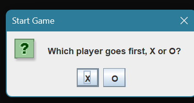
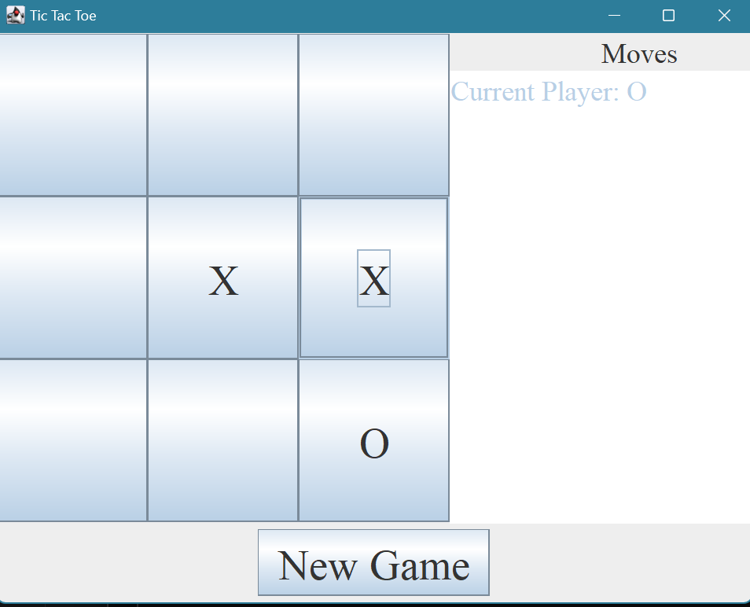
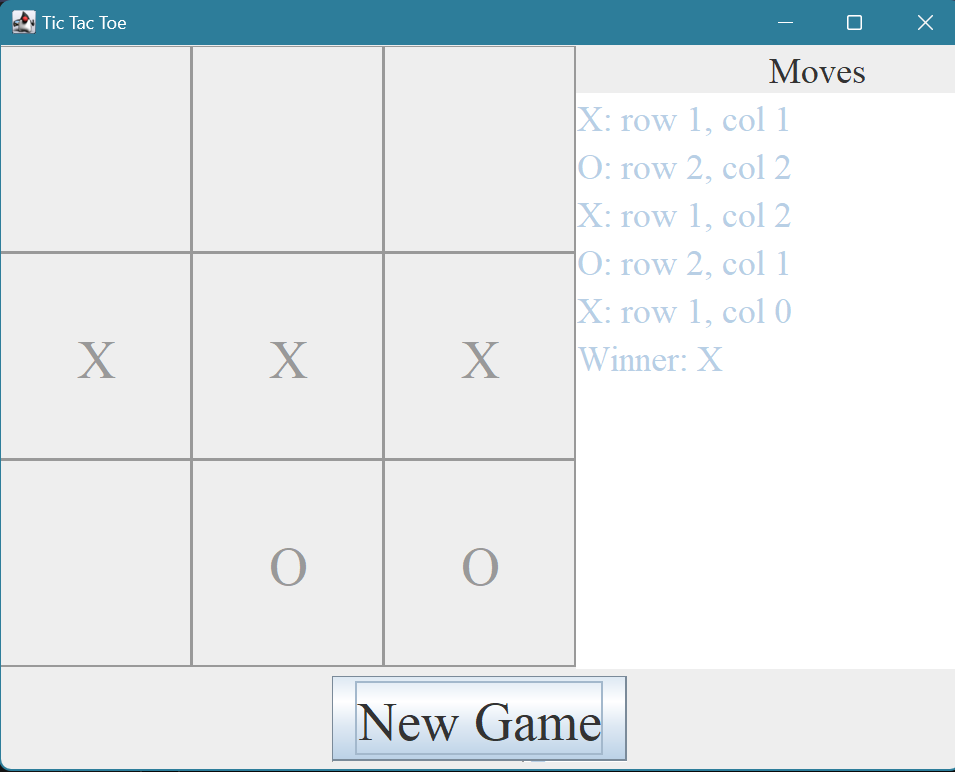

**NOTE: Before beginning the project, please remember to [open the workspace](images/open-lab-workspace.png) after cloning this repository in VSCode.**
# Project 3: TicTacToe

## Purpose & Concepts: 
In this project you will practice concepts covered up to an including Module 8. In particular, you will demonstrate using 1D and 2D arrays, implementing a testable interface, and developing a GUI from scratch.

## Problem Description
For this project, you will create a class (`TicTacToeGame`) that implements logic for a game of [tic-tac-toe](https://en.wikipedia.org/wiki/Tic-tac-toe), and then you will create a GUI (`TicTacToeGUI`) that uses that class to allow two players to play an interactive game of tic-tac-toe. Your class `TicTacToeGame` will implement the `TicTacToe` interface that defines methods to manage game state information and logic for a game of tic-tac-toe. After successfully implementing TicTacToeGame, you will build a graphical user interface (GUI) to interactively play a game of tic-tac-toe against another opponent.  

## Requirements

### TicTacToeGame
1. Create a class TicTacToeGame that implements TicTacToe.java: `public class TicTacToeGame implements TicTacToe { }`
2. TicTacToeGame must correctly implement the TicTacToe interface to enforce all rules of the game to pass all tests in TicTacToeTester and work with your TicTacToeGUI. 
3. You must use arrays (not ArrayLists) for storing and working with game data - a 2D BoardChoice array for the game grid, and a 1D Point (from java.awt) array for the history of moves. These are some of the fields, but likely not all. Please note, like all classes, you should specify a constructor.

### TicTacToeGUI Requirements
1. TicTacToeGUI must use an instance of TicTacToeGame to manage all game logic.
2. Allow the user to choose if X will go first or if O will go first.
3. Display whose turn it is to move.
4. Display the game board and allow user to choose a move by clicking on the square where they want to make their move.
5. When game play is over (whether because of a win, loss, or draw) display the sequence of moves that were made during the game, which player made them, and the final outcome of the game. 
6. Allow the user to start a new game.

Below is a simple sample GUI. Your GUI *cannot* look like this. 

Your GUI should **not** look like this one. This is just an example to show what some of the fields can look like. Showcase your creativity and design skills in your GUI implementation.

#### TicTacToeGUI Hints
1. Plan - Layout before Functionality

    * Complete the entire GUI layout in the main panel constructor FIRST.
    * Draw out your layout plan before touching any code.
    *  Declare all component and panel variables in the constructor for now. (Only promote a component to an instance variable when you find you need it in a listener.)
    * Remember to organize code “inside-out”. Initialize components completely before adding them to their subpanels. Add subpanels to the main panel at the end. (Set layout managers for panels before adding anything to them.)

2. Then Functionality - Work in stages, prioritizing basics first.

    * Start with the basic game play.  Confirm that only valid moves are being allowed, button text shows claimed positions, and play is transitioning correctly between X and O. Check for game over after every move. When the game ends, display the sequence of moves in the text area and do not allow any additional moves.
    * Then add the New Game functionality.  Reset the TicTacToeGame, GUI game grid, and moves TextArea for a new game when the New Game button is clicked.
    * Finally - only after all of the above is working - enable switching the first player. Switching should only be possible between games. After that, the regular button listening logic should be able to handle alternating turns without any changes.

3. Some things that might make your life easier
    
    * Create Action Listeners exactly like you did in the in class activities and as shown in the slides.
    * It is not necessary, but it may make things easier if you create a custom game grid button class (extends JButton) with row and column instance variables, so the button can be told its location when it is created and report its location through getters when clicked. (Otherwise, you’ll need to search your 2D button array to match a clicked button to its location in the array.)
    * Consider private utility methods for setting up new games, responding to a game over situation, etc.

## Before You Begin: Computational Thinking & Planning
1. Before you begin, read **all** project requirements and **all** given source files carefully and completely. Pay special attention to the javadocs in the interface `TicTacToe` to understand what is expected from each method.
2. Make sure you understand the relationships between the classes involved in this project.
3. Fill in PLAN.md. Pay special attention to your testing plans.
4. While the requirements are listed succinctly, there are a lot of pieces required to make this project work. Be sure you have included a plan for all required pieces.

## To Do
1. Create `TicTacToeGame.java` and `TicTacToeGUI.java` in the `project3` folder.
2. As soon as you have created the class `TicTacToeGame`, run the test class `TicTacToeTester` to confirm that it compiles and runs. At first, most tests are expected to fail. When you have completed `TicTacToeGame` all tests should pass.
4. Be sure to review the requirements given in this document as well as the rubric in GRADE.md.
    

## Review & Reflect
1. Write a two to three paragraph reflection describing your experience with this project. Talk about what worked well and what didn't work so well in planning, coding, and testing.  Did you run into an issue that took some time to figure out?  Tell us about it. Write the reflection in PLAN.md

## Finally
1. Commit the changes to your local repository with a message stating that Project 3 is complete.
2. Push the changes from your local repository to the GitHaub classroom repository.
